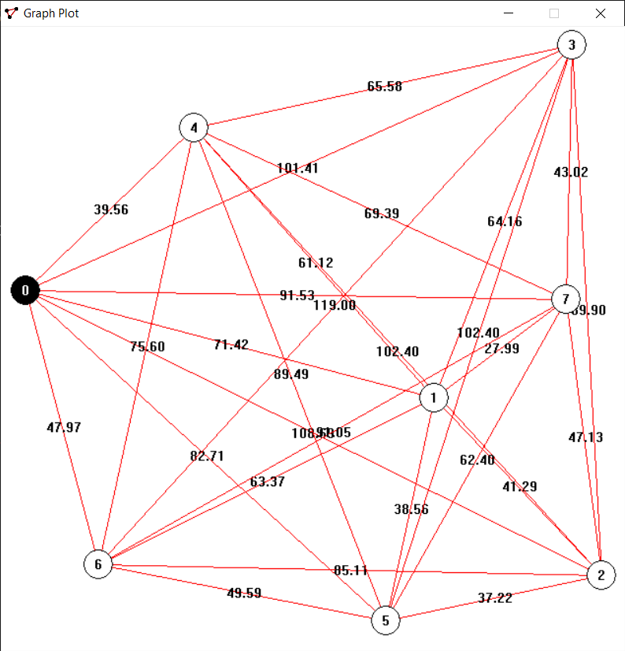
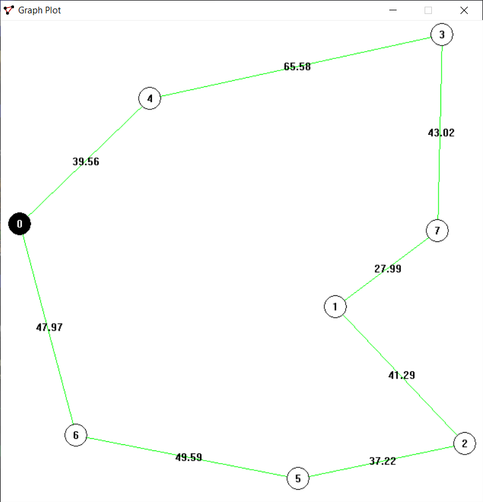
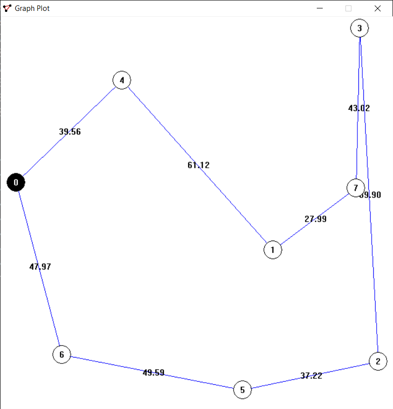
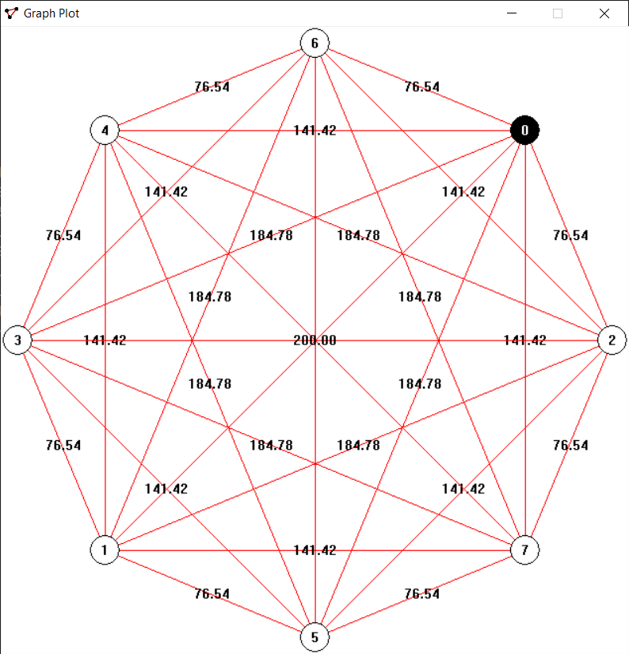
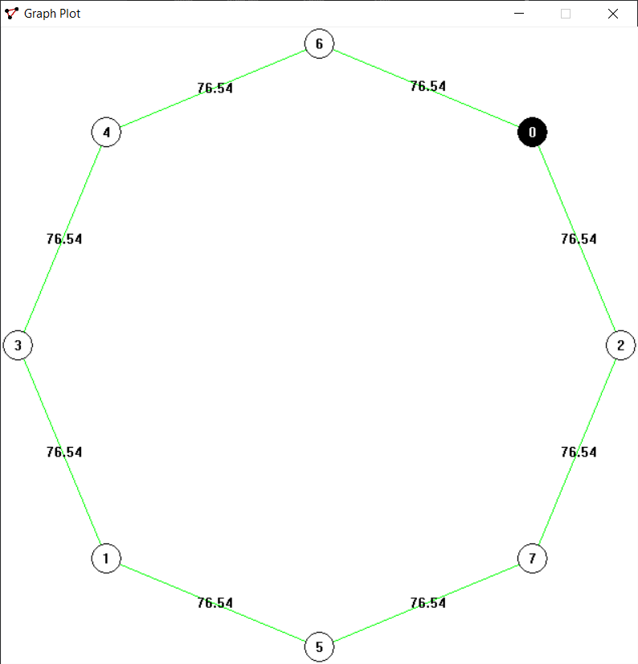
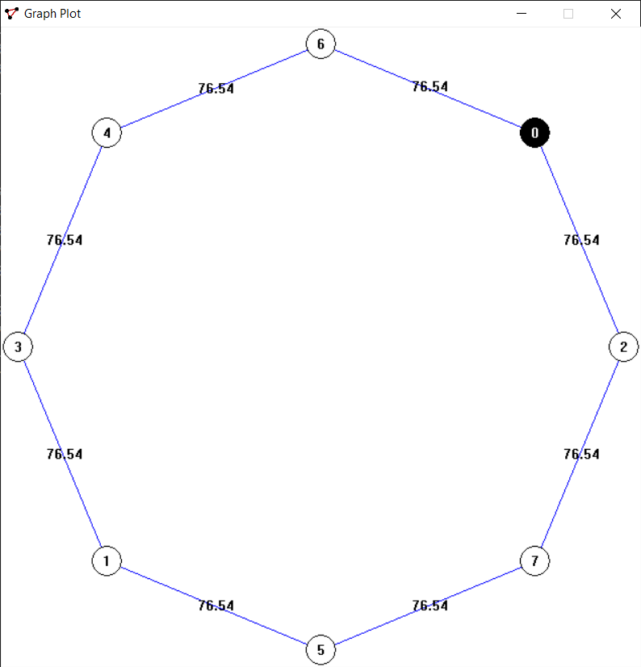

# Lab0xFF - Travelling Salesman Problem
Fall 2021

This is the final lab for CSC-482 Algorithms and Optimizations

Dakota State University

Professor Scott Graham (OverProf)

## About
This project was created with Embarcadero Dev-C++.

Language: C (Make sure to specify the linker command `-lgdi32` to include the GDI library).

To run the program, only choose **one** of the following client files depending on the actions you wish to complete. Disable the others from being compiled.

- [verify.c](verification_test/verify.c)  
Verify the algorithm's results for small graph sizes. Results can be visually displayed.
- [time.c](time_test/time.c)  
Test and print the time taken by an algorithm with increasing graph sizes.
- [qualify.c](quality_test/qualify.c)  
Test and print quality of heuristic algorithm results.

## Example Graph Displays

Original Euclidean 8 Node:

Brute Force Path:

Greedy Path:

Original Circular 8 Node:

Brute Force Path:

Greedy Path:

